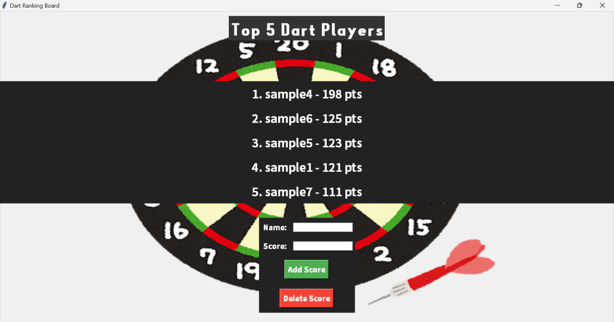

# Dart_Score_Board

**Dart_Score_Board**は、ダーツゲームのスコアを管理し、トップ5のプレイヤーをリアルタイムで表示するGUIアプリケーションです。文化祭やイベントなどでダーツを運営する際に、スコアランキング機能を提供するために開発されました。




## 機能
- トップ5のダーツスコアを表示
- 新しいスコアの追加、既存スコアの削除
- スコアデータをJSONファイルに保存、読み込み

## 実行環境

### 必要なPythonの環境
- Python 3.x
- 以下のPythonライブラリが必要です:
  - `tkinter`（標準ライブラリとして含まれている）
  - `Pillow`（画像処理用）

  ライブラリは次のコマンドでインストール可能です:
```bash
  pip install Pillow
```

### フォントの環境
本アプリケーションは、フォントとして[YDW バナナスリップplus plus](https://sankoufont.com/japanese-font/bananaslip-plus/)，[源ノ角ゴシック JP](https://github.com/adobe-fonts/source-han-sans/tree/release/SubsetOTF)を使用しています。システムに適切なフォントがインストールされている必要があります。インストールされていない場合は、システムのフォント設定に応じてフォントを変更してください。

## 実行方法
1. リポジトリをクローンします
```
git clone https://github.com/kinn00kinn/Dart_Score_Board.git
cd Dart_Score_Board
```

2. アプリケーションを起動します
```
python main.py
```

## 操作方法
スコアの挿入
1. 名前とスコアを入力します。
2. Add Scoreボタンをクリックすると、新しいスコアがリストに追加されます。
3. 追加されたスコアは、リアルタイムでトップ5に表示されます。

スコアの削除
1. 削除したいプレイヤーの名前を入力します。
2. Delete Scoreボタンをクリックすると、そのプレイヤーのスコアが削除され、ランキングが更新されます。
3. スコアの保存・読み込み（JSONファイル）
4. スコアは、dart_scores.jsonファイルに自動で保存されます。このファイルからスコアデータを読み込んで、アプリケーション起動時にランキングが復元されます。

## ライセンス
このプロジェクトはMITライセンスのもとで公開されています。